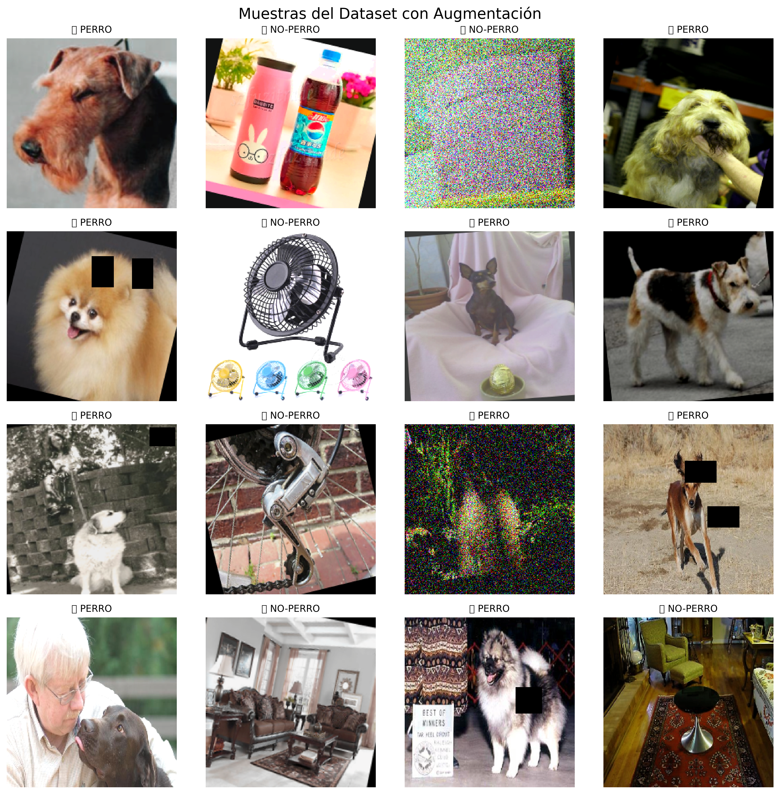
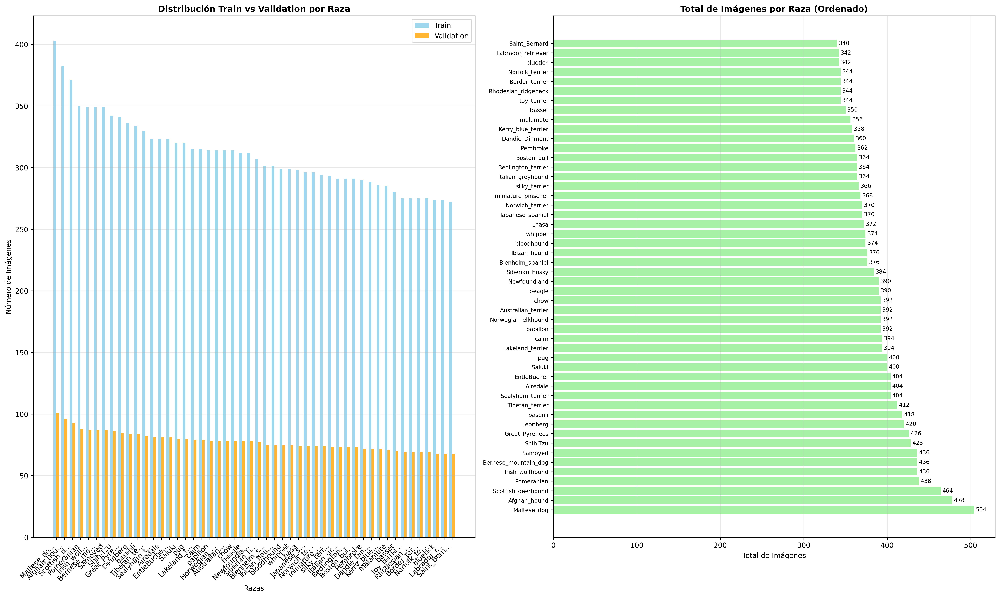
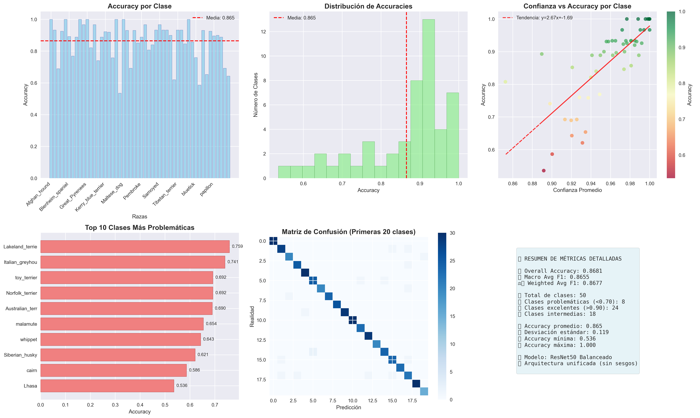
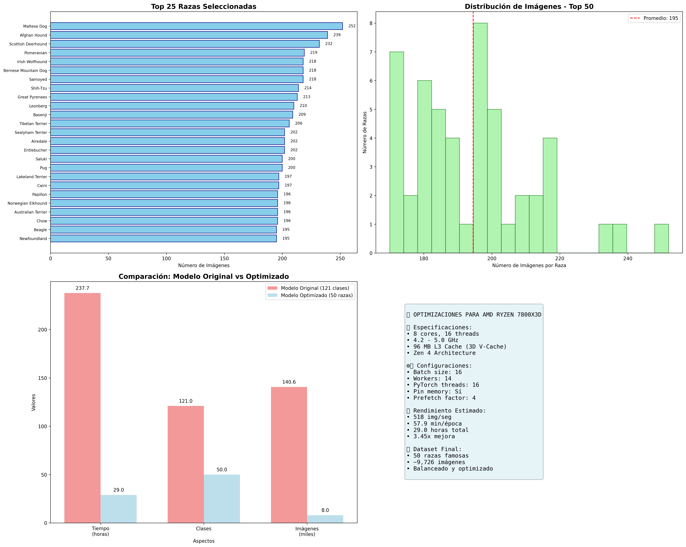

# NOTDOG YESDOG -- Dog Detection and Breed Classification


A production-oriented deep learning system for image classification, built with PyTorch and served through FastAPI. The system uses a hierarchical two-stage approach:

1. **Binary classification** -- determines whether an image contains a dog or not.
2. **Breed classification** -- if a dog is detected, identifies the specific breed among 119 classes.

The project includes the full ML lifecycle: dataset preparation, data augmentation, model training with transfer learning, cross-validation, bias analysis, inference optimization, REST API deployment, and frontend interfaces.

---

## Table of Contents

- [Architecture Overview](#architecture-overview)
- [Tech Stack](#tech-stack)
- [Repository Structure](#repository-structure)
- [Environment Requirements](#environment-requirements)
- [Quick Start](#quick-start)
- [Training Pipeline](#training-pipeline)
- [Training Progression and Results](#training-progression-and-results)
- [Evaluation and Validation](#evaluation-and-validation)
- [API Endpoints](#api-endpoints)
- [Frontend Interfaces](#frontend-interfaces)
- [AWS S3 Model Hosting](#aws-s3-model-hosting)
- [Model Artifacts and Storage](#model-artifacts-and-storage)
- [Configuration](#configuration)
- [Contributing](#contributing)
- [Acknowledgments](#acknowledgments)
- [License](#license)

---

## Architecture Overview

```
                         Input Image
                              |
                    +---------v----------+
                    |  Stage 1: Binary   |
                    |  EfficientNet-B3   |
                    |  (DOG / NOT-DOG)   |
                    +---------+----------+
                              |
                     Is it a dog?
                    /              \
                  NO                YES
                  |                  |
           Return NOT-DOG   +-------v--------+
                            | Stage 2: Breed |
                            |   ResNet50     |
                            | (119 classes)  |
                            +-------+--------+
                                    |
                            Top-5 predictions
                            with confidence %
```

The hierarchical approach improves accuracy by first filtering non-dog images before running the more expensive breed classification.

---

## Tech Stack

| Layer | Technology |
|---|---|
| Deep Learning Framework | PyTorch 2.0+ with torchvision |
| Model Architectures | EfficientNet-B3 (binary), ResNet50 (breed) |
| Model Optimization | ONNX, ONNXRuntime |
| GPU Acceleration | AMD ROCm 5.4.2 (also compatible with CUDA) |
| Image Processing | OpenCV, Pillow, albumentations |
| Data Analysis | scikit-learn, pandas, numpy |
| Visualization | matplotlib, seaborn |
| API Framework | FastAPI + Uvicorn |
| Frontend (SPA) | React 18, react-dropzone |
| Frontend (Static) | Vanilla HTML/CSS/JS |
| Cloud Storage | AWS S3 (model weights hosting) |
| Logging | loguru |

---

## Repository Structure

```text
NOTDOG YESDOG/
|
|-- Core API Servers
|   |-- api_server.py                  # FastAPI binary classification server
|   |-- hierarchical_api.py           # Hierarchical (binary + breed) API
|   |-- testing_api_119_classes.py    # 119-class breed classification API (S3 fallback)
|
|-- Training Pipeline
|   |-- main_pipeline.py              # End-to-end training entrypoint
|   |-- model_trainer.py              # Core training loop
|   |-- breed_trainer.py              # Breed-specific trainer
|   |-- binary_trainer.py             # Binary (dog/not-dog) trainer
|   |-- simple_binary_trainer.py      # Lightweight binary training
|   |-- simple_breed_trainer.py       # Lightweight breed training
|   |-- progressive_train.py          # Progressive training strategy
|   |-- quick_train.py                # Quick training for prototyping
|
|-- Data Preparation
|   |-- data_preprocessor.py          # Image preprocessing pipeline
|   |-- breed_preprocessor.py         # Breed-specific data preparation
|   |-- balance_dataset.py            # Class balancing (over/undersampling)
|   |-- targeted_data_augmentation.py # Augmentation for underrepresented classes
|   |-- top_50_selector.py            # Breed subset selection utility
|
|-- Evaluation and Analysis
|   |-- stratified_cross_validation.py # Stratified K-Fold cross-validation
|   |-- detailed_class_evaluator.py   # Per-class metrics and threshold tuning
|   |-- selective_retraining.py       # Fine-tuning on underperforming classes
|   |-- breed_analyzer.py             # Dataset and class distribution analysis
|   |-- data_analyzer.py              # General dataset statistics
|   |-- unbiased_dog_classifier.py    # Bias-aware evaluation pipeline
|
|-- Inference and Optimization
|   |-- inference_optimizer.py        # PyTorch to ONNX conversion, production prep
|   |-- gpu_detector.py               # Hardware detection (CUDA/ROCm/CPU)
|   |-- config.py                     # Centralized configuration
|   |-- breed_config.py               # Breed-specific configuration
|
|-- Frontend
|   |-- dog-detector-frontend/        # React 18 SPA
|   |   |-- src/
|   |   |   |-- App.js
|   |   |   |-- components/
|   |   |       |-- ImageUpload.js
|   |   |       |-- ResultDisplay.js
|   |   |       |-- ParticleBackground.js
|   |-- simple_frontend_119.html      # Static HTML frontend (119 classes)
|   |-- hierarchical_frontend.html    # Static frontend for hierarchical API
|   |-- app.js                        # Shared frontend logic
|   |-- styles.css                    # Shared styles
|
|-- Startup Scripts
|   |-- INICIAR_SISTEMA.bat           # Windows: start full system
|   |-- iniciar_sistema.sh            # Linux/macOS: start full system
|   |-- start_frontend_119_classes.bat
|   |-- start_app.bat
|
|-- Documentation
|   |-- README.md
|   |-- CHANGELOG.md
|   |-- CONTRIBUTING.md
|   |-- VERSIONING.md
|   |-- FRONTEND_119_TESTING_GUIDE.md
|   |-- LICENSE
|
|-- Configuration Files
|   |-- requirements.txt              # Python dependencies
|   |-- adaptive_thresholds.json      # Per-breed confidence thresholds
|   |-- breed_to_idx_mapping.json     # Breed-to-index label mapping
|   |-- top_50_breeds_config.json     # Breed subset configuration
```

---

## Environment Requirements

**Minimum:**
- Python 3.10+
- 16 GB RAM
- Multi-core CPU

**Recommended (for training):**
- AMD GPU with ROCm 5.4.2+ or NVIDIA GPU with CUDA
- 32 GB RAM
- NVMe storage for dataset I/O

**Hardware tested on:** AMD 7800X3D CPU + AMD 7900XTX GPU

---

## Quick Start

### 1. Create and activate a virtual environment

Windows (PowerShell):
```powershell
python -m venv .venv
.\.venv\Scripts\Activate.ps1
```

Linux/macOS:
```bash
python -m venv .venv
source .venv/bin/activate
```

### 2. Install dependencies

```bash
pip install -r requirements.txt
```

### 3. Start the API server

Binary classification server:
```bash
python api_server.py
```

Hierarchical classification server (binary + breed):
```bash
python hierarchical_api.py
```

119-class breed classification server (with S3 model fallback):
```bash
python testing_api_119_classes.py
```

The API will be available at:
- http://localhost:8000 -- Interactive web UI
- http://localhost:8000/docs -- OpenAPI (Swagger) documentation
- http://localhost:8000/redoc -- ReDoc documentation

---

## Training Pipeline

The training pipeline supports multiple strategies depending on the goal:

### Full end-to-end pipeline
```bash
python main_pipeline.py
```

### Binary model training (DOG vs NOT-DOG)
```bash
python binary_trainer.py
# or lightweight version:
python simple_binary_trainer.py
```

### Breed classification training (119 classes)
```bash
python breed_trainer.py
# or lightweight version:
python simple_breed_trainer.py
```

### Progressive training
```bash
python progressive_train.py
```

### Data preparation
```bash
# Analyze dataset distribution
python data_analyzer.py
python breed_analyzer.py

# Balance classes via augmentation
python balance_dataset.py
python targeted_data_augmentation.py
```

All training configuration (batch size, learning rate, epochs, architecture, etc.) is centralized in `config.py`.

---

## Training Progression and Results

This section documents the complete iterative process from raw data to the final production model. Each phase produced visualizations and reports that guided decisions for the next phase.

### Phase 1: Raw Data Analysis

The project started with a raw dataset of dog images organized by breed. The first step was analyzing the distribution to identify class imbalances.

| Metric | Value |
|---|---|
| Total breeds | 50 |
| Total images | 8,079 |
| Mean per class | 161.58 |
| Std deviation | 37.72 |
| Coefficient of variation | 0.233 |
| Min images/class | 131 |
| Max images/class | 246 (Maltese dog) |
| Balance status | Moderate imbalance |


*Initial dataset analysis revealing moderate class imbalance across 50 breeds.*


*Sample visualization of preprocessed images after normalization and augmentation transforms.*

### Phase 2: Dataset Balancing (50 breeds)

A conservative balancing strategy was applied to bring all 50 breeds to exactly 161 images each. 33 breeds required augmentation (up to +30 images each), 17 breeds required reduction (up to -85 images).

| Metric | Before | After |
|---|---|---|
| Total images | 8,079 | 8,050 |
| Std deviation | 37.72 | 0.0 |
| Coefficient of variation | 0.233 | 0.0 |
| Images per class | 131-246 | 161 (exact) |


*Breed distribution after balancing -- all 50 classes at exactly 161 images.*


*Sample images from balanced breed dataset showing the visual diversity within and across breeds.*

### Phase 3: Initial Model Training (50 breeds)

The balanced 50-breed dataset was used to train the first model over 25 epochs with a ResNet-based architecture.

| Metric | Value |
|---|---|
| Epochs | 25 |
| Final train accuracy | 99.46% |
| Best validation accuracy | 88.14% |
| Train loss (start to end) | 2.009 to 0.021 |
| Best validation loss | 0.561 (epoch 12) |

Validation accuracy plateaued around epochs 18-25 (~87.5-88.1%), while training accuracy kept climbing -- indicating mild overfitting in later epochs.


*Training and validation loss/accuracy curves over 25 epochs. The gap between train and validation accuracy indicates mild overfitting after epoch 18.*

### Phase 4: Bias Analysis (50 breeds)

A systematic bias audit identified 12 distinct biases in the initial model:

| Bias Category | Finding |
|---|---|
| Representation | Perfectly balanced (CV=0.0) |
| Geographic | 63.3% European breeds, only 14.3% Asian, 4.1% African |
| Architectural | Hybrid architecture created unfair advantages for 6 breeds |
| Evaluation | Single accuracy metric, single threshold (0.35) for all breeds |
| Main accuracy | 88.14% |
| Selective model accuracy | 95.15% |

The recommendations were: unify the model architecture, diversify the dataset geographically, implement per-class metrics, and use stratified k-fold cross-validation.


*Bias analysis report showing the 12 identified biases across representation, geographic, architectural, and evaluation dimensions.*

### Phase 5: Scaling to 119 Breeds

The dataset was expanded from 50 to 120 breeds with two-pass augmentation:

**First pass (balanced augmentation):**

| Metric | Value |
|---|---|
| Original images | 20,580 |
| Generated images | 3,674 |
| Total | 24,254 |
| Breeds augmented | 103 of 120 |
| Problematic breeds | 8 (terriers, huskies, sighthounds) |

**Second pass (targeted augmentation):**

| Metric | Value |
|---|---|
| Target per class | 252 (matched to largest class) |
| Generated images | 9,660 |
| Result | All 120 classes at exactly 252 images |


*Targeted augmentation report showing the amount of synthetic data generated per breed to reach uniform class sizes.*

### Phase 6: Stratified 5-Fold Cross-Validation (119 classes)

With the expanded dataset (29,988 samples, 119 classes), a 5-fold stratified cross-validation was performed using ResNet50:

| Metric | Mean | Std | Min | Max |
|---|---|---|---|---|
| Accuracy | 78.16% | 0.34% | 77.76% | 78.78% |
| Precision | 79.75% | 0.31% | 79.40% | 80.14% |
| Recall | 78.16% | 0.34% | 77.76% | 78.78% |
| F1-score | 77.64% | 0.39% | 77.22% | 78.30% |

The 10-point drop from 88% (50 breeds) to 78% (119 breeds) is expected with 2.4x more classes. The very low standard deviation across folds (0.34%) indicates stable generalization.


*5-fold stratified cross-validation results showing consistent accuracy across all folds with minimal variance.*

### Phase 7: Per-Class Evaluation and Top Breed Analysis

Detailed per-class evaluation on 1,410 test samples revealed the model's strengths and weaknesses:

| Metric | Value |
|---|---|
| Overall accuracy | 86.81% |
| Macro precision | 87.36% |
| Macro recall | 86.53% |
| Macro F1 | 86.55% |

**Best performers:** Afghan hound and Bernese mountain dog achieved 100% accuracy with 99.99% confidence.

**Weakest performers:** Australian terrier (68.97%), Border terrier (76.92%) -- breeds with high visual similarity to other terrier varieties.


*Detailed per-class evaluation showing precision, recall, and F1 for each breed. The performance gap between top and bottom breeds is ~31%.*


*Top 50 breeds analysis showing the relationship between dataset representation and model performance.*

### Phase 8: Confusion Analysis and Retraining Decision

The final analysis identified three main confusion groups:

- **Small terriers:** cairn, Australian terrier, Norfolk terrier, toy terrier, Lakeland terrier, Border terrier
- **Nordic/Spitz breeds:** Siberian husky vs. malamute
- **Sighthounds:** whippet vs. Italian greyhound vs. Ibizan hound

Two breeds were flagged as critical (recall below 60%): Lhasa (53.57%) and cairn (58.62%).

After evaluating the trade-offs, the retraining analysis concluded that the current model with adaptive per-breed thresholds is sufficient. Full retraining was not recommended -- instead, the system uses breed-specific confidence thresholds stored in `adaptive_thresholds.json` to compensate for visually similar breed confusion.


*Retraining analysis showing per-breed accuracy distribution and identifying the underperforming breeds that were candidates for selective fine-tuning.*


*Radar chart summarizing the factors weighed in the retraining decision: overall accuracy, variance across breeds, data sufficiency, and improvement potential.*

### Summary of Training Evolution

```
Raw Data (8,079 images, 50 breeds, CV=0.233)
    |
    v  Balance to 161 images/class
Balanced Data (8,050 images, CV=0.0)
    |
    v  Train 25 epochs (ResNet)
Initial Model --> 88.14% validation accuracy (50 breeds)
    |
    v  Bias analysis --> 12 biases identified
    v  Scale to 120 breeds, augment to 252 images/class
Full Dataset (30,240 images, 120 classes)
    |
    v  5-fold stratified cross-validation
78.16% mean accuracy (119 classes, std=0.34%)
    |
    v  Per-class evaluation
86.81% overall accuracy, 15 high-risk breeds identified
    |
    v  False negative analysis --> 2 critical, 7 high-priority breeds
    v  Retraining analysis
Final Decision: KEEP current model + adaptive thresholds
```

---

## Evaluation and Validation

### Stratified K-Fold Cross-Validation

```bash
python stratified_cross_validation.py
```

Runs 5-fold stratified cross-validation with ResNet50, preserving class distribution across folds. Outputs per-fold metrics, aggregate statistics, and visualization plots.

### Per-Class Evaluation and Threshold Tuning

```bash
python detailed_class_evaluator.py
```

Computes precision, recall, and F1 per breed. Generates confusion matrices and calculates **optimal per-class confidence thresholds** saved to `adaptive_thresholds.json`. This allows the system to use different decision boundaries for breeds that are frequently confused.

### Selective Retraining

```bash
python selective_retraining.py
```

Fine-tunes a lightweight classifier only on underperforming breeds, avoiding full retraining of the 119-class model.

### Bias Analysis

```bash
python unbiased_dog_classifier.py
```

Evaluates the model for systematic bias across breed categories and generates detailed reports.

---

## API Endpoints

### Binary Classification Server (`api_server.py`)

| Method | Endpoint | Description |
|---|---|---|
| GET | `/` | Interactive web UI for image upload |
| GET | `/health` | Service health and model status |
| POST | `/predict` | Classify a single image (DOG / NOT-DOG) |
| POST | `/predict/batch` | Classify up to 10 images at once |
| GET | `/stats` | Prediction statistics and recent history |
| POST | `/reload-model` | Hot-reload the model without restart |
| GET | `/docs` | OpenAPI interactive documentation |

### Hierarchical Server (`hierarchical_api.py`)

| Method | Endpoint | Description |
|---|---|---|
| POST | `/classify` | Full pipeline: dog detection + breed identification |
| POST | `/detect-dog` | Binary dog detection only |
| POST | `/classify-breed` | Breed classification only (assumes dog) |
| GET | `/breeds` | List all 119 available breeds |
| GET | `/health` | System health check |

### 119-Class Server (`testing_api_119_classes.py`)

| Method | Endpoint | Description |
|---|---|---|
| POST | `/predict` | Breed classification with top-5 predictions |
| GET | `/health` | Health check with model download status |

---

## Frontend Interfaces

### React SPA

Located in `dog-detector-frontend/`. Features drag-and-drop image upload, animated particle background, and breed prediction display.

```bash
cd dog-detector-frontend
npm install
npm start
```

Runs on http://localhost:3000 and proxies API calls to http://localhost:8000.

### Static HTML Frontends

- `simple_frontend_119.html` -- 119-class breed classifier interface
- `hierarchical_frontend.html` -- Hierarchical (binary + breed) interface

Serve locally:
```bash
python -m http.server 8080
```

Or use the startup scripts:
```bash
# Windows
start_frontend_119_classes.bat

# Linux/macOS
./iniciar_sistema.sh
```

See `FRONTEND_119_TESTING_GUIDE.md` for detailed frontend testing instructions.

### Frontend Evidence

The following screenshots show the current frontend results and interface states:

<table>
    <tr>
        <td></td>
        <td></td>
    </tr>
    <tr>
        <td></td>
        <td></td>
    </tr>
    <tr>
        <td></td>
        <td></td>
    </tr>
    <tr>
        <td></td>
        <td></td>
    </tr>
</table>

---

## AWS S3 Model Hosting

Model weights are hosted on **AWS S3** for remote deployment scenarios where model files are not bundled with the application.

**Bucket:** `notdog-yesdog-heavy-814298259360`
**Region:** `us-east-1`

### How it works

The 119-class API server (`testing_api_119_classes.py`) implements automatic model downloading:

1. On startup, the server checks if model `.pth` files exist locally.
2. If not found, it downloads them from the public S3 bucket.
3. Downloads include retry logic and timeout handling.

**Public model URL:**
```
https://notdog-yesdog-heavy-814298259360.s3.us-east-1.amazonaws.com/models/best_model_fold_0.pth
```

### Environment variable overrides

| Variable | Default | Description |
|---|---|---|
| `MODEL_PUBLIC_URL` | S3 URL above | Primary model download URL |
| `MODEL_PUBLIC_URLS` | -- | Comma-separated list of fallback URLs |
| `MODEL_DOWNLOAD_RETRIES` | `2` | Number of download retry attempts |
| `MODEL_DOWNLOAD_TIMEOUT` | `60` | Download timeout in seconds |

This allows the API to be deployed on any server (cloud VM, container, etc.) without pre-bundling the model weights -- they are fetched on first startup from S3.

---

## Model Artifacts and Storage

Model files (`.pth`, `.pt`, `.onnx`) are excluded from Git via `.gitignore` due to their size. They should be managed through:

- **AWS S3** -- for production deployment (see above)
- **GitHub Releases** -- attach model binaries as release assets
- **Git LFS** -- for version-controlled large file storage

### Inference Optimization

The `inference_optimizer.py` module converts trained PyTorch models to optimized production formats:

- **TorchScript** (`.pt`) -- for PyTorch-native deployment
- **ONNX** (`.onnx`) -- for cross-platform inference with ONNXRuntime

Optimized models are stored in `./optimized_models/` with accompanying metadata JSON files.

---

## Configuration

All training and inference parameters are centralized in `config.py`:

| Parameter | Default | Description |
|---|---|---|
| Model architecture | EfficientNet-B3 | Binary classifier backbone |
| Input size | 224x224 | Image resolution |
| Batch size | 32 | Training batch size |
| Epochs | 30 | Training epochs |
| Learning rate | 1e-3 | Initial learning rate |
| Weight decay | 1e-4 | L2 regularization |
| Freeze epochs | 5 | Epochs with frozen backbone |
| Balance strategy | undersample | Class balancing method |

Breed-specific configuration is in `breed_config.py` and `top_50_breeds_config.json`.

Per-breed confidence thresholds are stored in `adaptive_thresholds.json`, generated by the detailed class evaluator.

---

## Contributing

See [CONTRIBUTING.md](CONTRIBUTING.md) for the contribution workflow and pull request guidelines.

This project follows [Semantic Versioning](https://semver.org/). See [VERSIONING.md](VERSIONING.md) for the release policy.

---

## Acknowledgments

This project uses and builds upon the **Stanford Dogs Dataset**.

- **Dataset page:** http://vision.stanford.edu/aditya86/ImageNetDogs/main.html
- **Primary reference:** Aditya Khosla, Nityananda Jayadevaprakash, Bangpeng Yao, and Li Fei-Fei. *Novel dataset for Fine-Grained Image Categorization*. First Workshop on Fine-Grained Visual Categorization (FGVC), IEEE Conference on Computer Vision and Pattern Recognition (CVPR), 2011.
- **Secondary reference:** J. Deng, W. Dong, R. Socher, L.-J. Li, K. Li, and L. Fei-Fei. *ImageNet: A Large-Scale Hierarchical Image Database*. IEEE Conference on Computer Vision and Pattern Recognition (CVPR), 2009.

Special thanks to the Stanford Vision Lab and the original dataset authors for making this benchmark publicly available.

---

## License

See [LICENSE](LICENSE) for details.