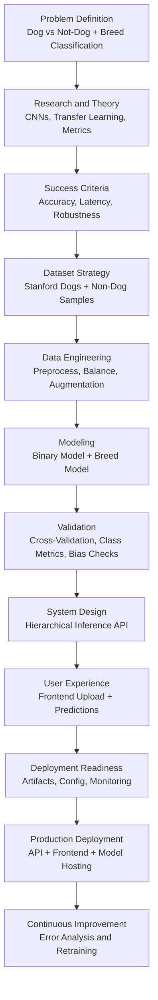
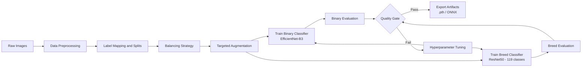
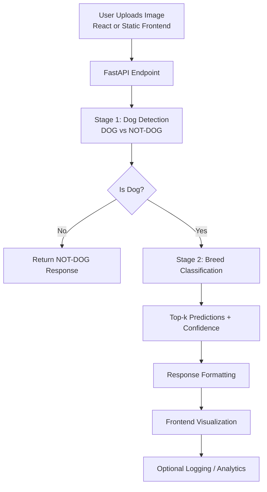
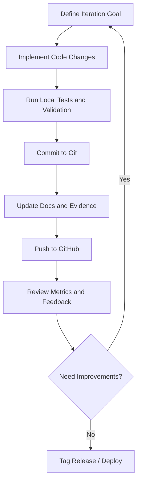

# Theory-to-Practice Project Flow Diagrams

This document summarizes the end-to-end journey of the **NOTDOG YESDOG** project from concept to deployment.

---

## 1) From Theory to Practical Product

---

## 2) ML Pipeline (Data to Trained Models)

---

## 3) Full Product Flow (User Request to Response)

---

## 4) Engineering Loop (Versioning to Release)

---

## Suggested Use in Presentations

- Diagram 1: Executive overview of the complete project journey.
- Diagram 2: Technical MLOps/training narrative.
- Diagram 3: Product behavior from end-user perspective.
- Diagram 4: Team workflow and delivery maturity.
